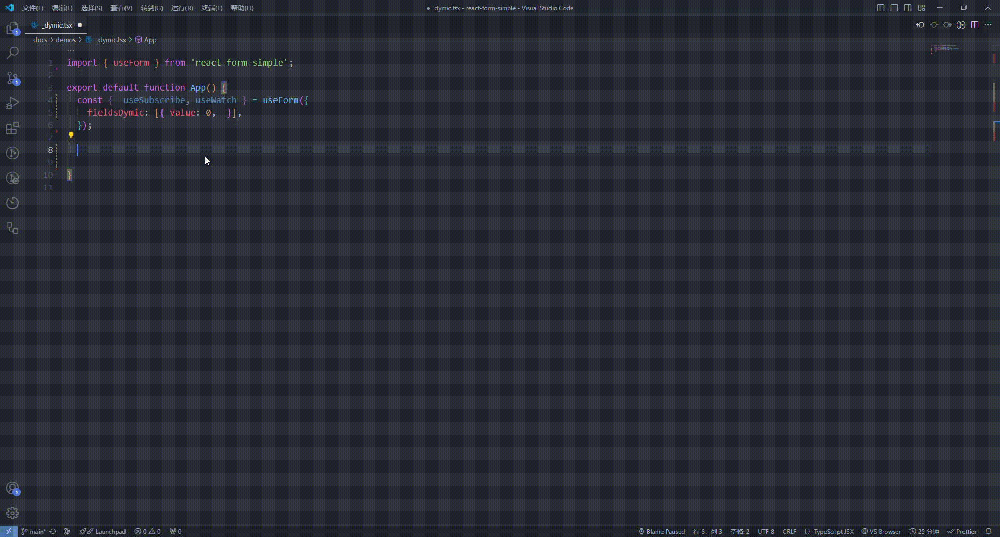

# 简介

表单构建不应该充满痛苦。React Form Simple 将使您编写更少的代码并具有更好的性能。

### 什么是 React-form-simple?

**react-form-simple** 是一个基于 react 的可受控可扩展的轻量级表单库。它提供了一套全面的解决方案，涵盖了数据绑定、验证规则、错误处理和 UI 更新等多个方面。其设计理念是简化开发流程，提升开发效率，并为开发者提供高度灵活和可扩展的工具。并高效构建复杂的表单应用。

**react-form-simple** 除了集成自身功能之外,还具有非常可扩展的接口, 并可与第三方 ui 轻易集成。

下面是一个最基本的例子：

```jsx | pure
import React, { useState } from 'react';
import { useForm } from 'react-form-simple';
export default () => {
  const { render, model } = useForm({ name: '', age: '' });

  const [modelState, setModelState] = useState('');

  const renderName = render('name')(<input className="input" />);

  const renderAge = render('age')(<input className="input" />);

  const renderSubmit = (
    <button onClick={() => setModelState(JSON.stringify(model))}>submit</button>
  );

  return (
    <>
      {renderName}
      {renderAge}
      {renderSubmit}
      {modelState}
    </>
  );
};
```

**效果展示**

```jsx
/**
 * inline: true
 */

import React, { useState } from 'react';
import { useForm } from 'react-form-simple';
import Demo from '@components/Demo';
export default () => {
  const { render, model } = useForm({ name: '', age: '' });

  const [modelState, setModelState] = useState('');

  const renderName = render('name')(<input />);

  const renderAge = render('age')(<input />);

  const renderSubmit = (
    <button onClick={() => setModelState(JSON.stringify(model))}>submit</button>
  );

  return (
    <Demo>
      {renderName}
      {renderAge}
      {renderSubmit}
      {modelState}
    </Demo>
  );
};
```

上面展示了两个引入步骤：

- **初始化模型**，通过 useForm 初始化表单模型数据。
- **渲染**，通过 render 函数搭建视图与模型之间的受控桥梁。

是的，你不需要关心任何的受控逻辑，它让表单应用的受控变得如此简单。你可能会有一些诸多使用上的疑问，请别急，后续章节会详细介绍使用上的细节。

## 功能特性

### <Mdh version="">简单高效的数据绑定</Mdh>

只需几行代码即可完成表单受控操作，无需关心复杂的受控逻辑和过程，只需关注受控结果和如何应用受控状态。

```jsx | pure
import { useForm } from 'react-form-simple';
export default () => {
  const { render } = useForm({ name: '', age: '' });

  const renderName = render('name')(<input />);

  const renderAge = render('age')(<input />);
};
```

### <Mdh version="">灵活的错误处理机制</Mdh>

提供灵活的错误处理机制，支持实时显示错误信息和自定义错误提示。无论是单个字段的错误处理还是整个表单的错误处理。

#### 库的内置校验

可以使用库中的内置校验器对传入的规则进行验证。

```jsx | pure
import React from 'react';
import { useForm } from 'react-form-simple';

export default function App() {
  const { render } = useForm({ name: 'name' });

  return render('name', {
    rules: [
      { required: 'Please Input' },
      {
        validator(value) {
          return String(value).length > 9 ? 'Max Limit' : '';
        },
      },
    ],
  })(<input />);
}
```

#### 手动校验

甚至可以手动调用 API，与第三方校验器完美集成，其表现出的行为将与内部校验完全一致。

```jsx | pure
import React from 'react';
import { useForm } from 'react-form-simple';

export default function App() {
  const { render, setError } = useForm({ name: 'name' });

  return (
    <>
      {render('name')(<input />)}
      <button
        onClick={() => {
          setError('Please Input');
        }}
      >
        validate
      </button>
    </>
  );
}
```

### <Mdh version="">高效的 UI 更新</Mdh>

每个表单项的渲染是完全隔离的，避免了在处理大型动态数据时出现的页面卡顿。如下两个表单项之间的渲染互不影响，也不会导致主页面的重新渲染。

```jsx | pure
import React from 'react';
import { useForm } from 'react-form-simple';

export default function App() {
  const { render } = useForm({ name: 'name', age: '' });

  return (
    <>
      {render('name')(<input />)}
      {render('age')(<input />)}
    </>
  );
}
```

### <Mdh version="">强大的数据观测功能</Mdh>

通过实时监控表单数据变化，确保数据同步，从而提升表单的动态响应能力。

```jsx | pure
import React from 'react';
import { useForm } from 'react-form-simple';

export default function App() {
  const { render, useWatch } = useForm({ name: 'name', age: '' });

  useWatch(
    ({ model }) => [model.name, model.age],
    (newValue, preValue) => {},
  );

  return (
    <>
      {render('name')(<input />)}
      {render('age')(<input />)}
    </>
  );
}
```

### <Mdh version="">灵活的使用方式和布局</Mdh>

支持手动布局和内置布局，开发者可以根据实际需求选择最适合的方式。

#### 添加表单项 label

```jsx | pure
import React from 'react';
import { useForm } from 'react-form-simple';

export default function App() {
  const { render } = useForm({ name: 'name', age: '' });

  return render('name', { label: 'name', labelPosition: 'top' })(<input />);
}
```

### <Mdh version="">轻松集成第三方 UI 库</Mdh>

支持与各种第三方 UI 库的无缝集成。下面展示与 Material UI 集成的一个直观例子。

```jsx | pure
import { TextField } from '@mui/material';
import React from 'react';
import { useForm } from 'react-form-simple';

export default function App() {
  const { render } = useForm({ name: '' }, { labelPosition: 'top' });

  return render('name', {
    label: 'name',
    rules: { required: 'please Input' },
    requireIndicator: true,
    defineProps({ isError }) {
      return { error: isError };
    },
  })(<TextField style={{ width: '300px' }} placeholder="Please Input" />);
}
```

### <Mdh version="">高度可扩展的接口</Mdh>

提供高度可扩展的接口，满足复杂需求和定制化场景。开发者可以根据实际需求定制表单的控制逻辑，灵活应对各种业务需求。

```jsx | pure
import React from 'react';
import { FormItem } from 'react-form-simple';

function App() {
  return (
    <>
      <FormItem
        bindId="name"
        getContent={({ attrs }) => <input className="input" {...attrs} />}
      />
      <FormItem
        bindId="select"
        getContent={({ attrs }) => (
          <select {...attrs}>
            <option value="name">name</option>
            <option value="age">age</option>
            <option value="email">email</option>
          </select>
        )}
      />
    </>
  );
}

export default App;
```

### <Mdh version="">完整的类型推断</Mdh>



### <Mdh version="">足够轻量</Mdh>

React Form Simple 几乎不依赖于第三方库，打包后体积仅为 130KB。
